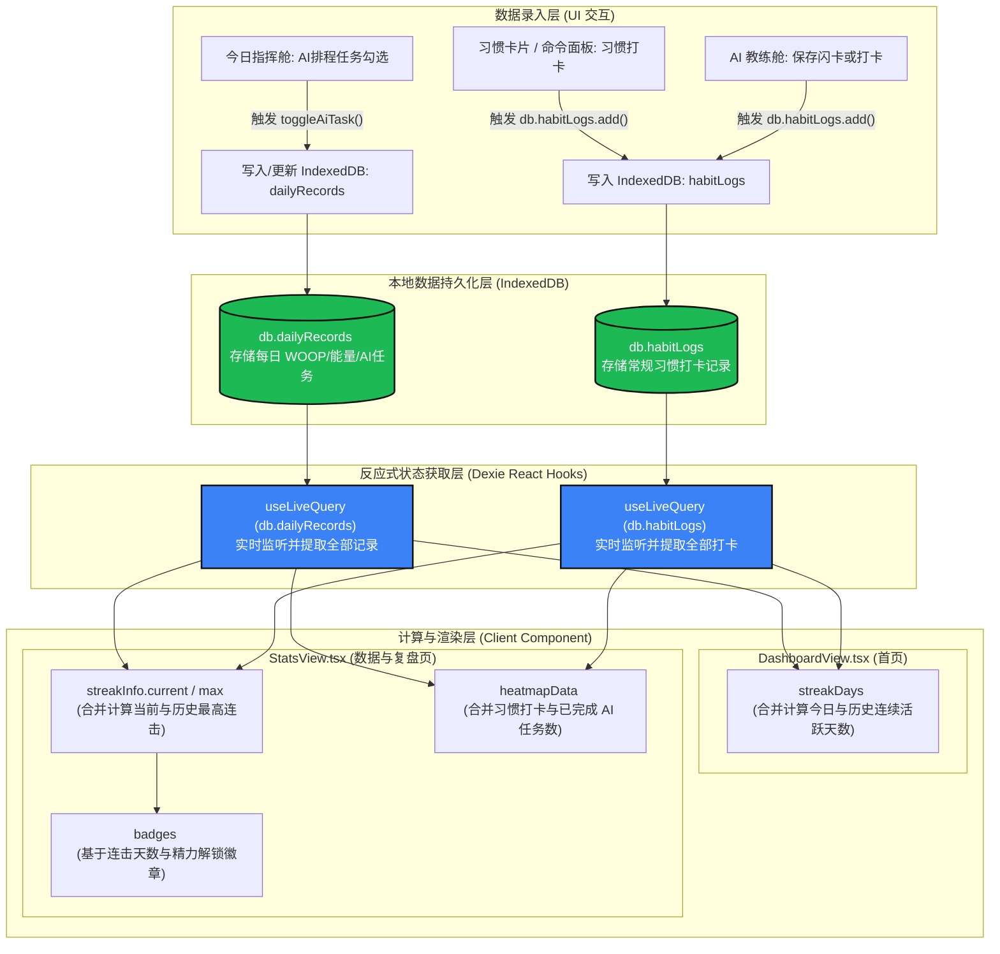

# GrowthOS 自律活跃数据链路文档

本篇文档记录了 GrowthOS 系统中关于**自律连击天数（Streaks）**和**打卡活跃热力图**的数据流向与计算架构，方便后续的维护与扩展。

---

## 🗺️ 自律活跃数据流向图 (Mermaid)

---

## 🔍 数据流与关键计算逻辑

### 1. 连续自律活跃日期收集 (Dates Set)
两端（主页与复盘页）连击天数和活跃度的计算都建立在同一个“自律活跃日期集合”基础之上：
* **常规习惯打卡日期**：遍历 `db.habitLogs` 的所有记录并提取其 `date`。
* **AI 任务完成日期**：遍历 `db.dailyRecords`，如果某天记录中的 `aiTasks` 数组里有至少一个任务的 `isCompleted` 状态为 `true`，则将当天的 `date` 计入活跃日期。

### 2. 核心文件与逻辑位置
* **首页连击天数计算**：
  * 文件：[DashboardView.tsx](file:///Users/alien/Documents/codes/GrowthOS/src/components/DashboardView.tsx) 中的 `streakDays`
  * 特点：使用 `useLiveQuery` 监听 `db.habitLogs` 和 `db.dailyRecords` 的异步查询，并通过从今天/昨天向后追溯的方式得出当前连续活跃天数。
* **数据与复盘页计算**：
  * 文件：[StatsView.tsx](file:///Users/alien/Documents/codes/GrowthOS/src/components/StatsView.tsx) 中的 `streakInfo` 与 `heatmapData`
  * 特点：使用内存响应式 state `habitLogs` 与 `dailyRecords`（分别由各自 the `useLiveQuery` 实时查询拉取）。`streakInfo` 用来计算当前连击天数与历史最高连击；`heatmapData` 将习惯打卡和已完成 AI 任务数合并，并在每一周的第一天（周一）绑定跨月标签 `isMonthStart` 和 `monthLabel`，数据以本周日为终点倒推 370 天（53 周）生成包含今天在内的全量日期网格；横轴上方月份标签采用与网格完全对称的 53 列 `grid grid-flow-col` 布局，通过在每个单元格内部绝对定位输出月份文字，配合左侧具有相同行高 `h-3.5` 及 `gap-1.5` 的星期标签，实现了全分辨率下的精密物理对齐。
